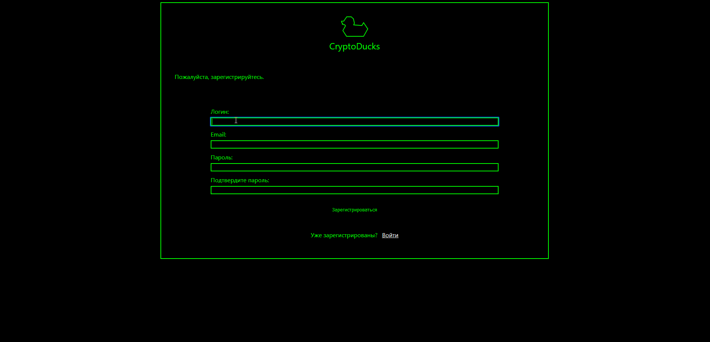

# Проект CryptoDucks
Проект создан для отработки навыков по React
***

 

## Начинка
* Регистрация пользователей
* Вход пользователей
* Верстка основной страничке
* Верстка учетной записи
***

## Используемые технологии:
* Git
* JavaScript
* Fetch API
* React.js
  * useState
  * useEffect
  * useHistory
  * localStorage
  * Switch
  * Route
  * Register
  * ProtectedRoute
***

## Инструкции по запуску:

* Скачать или склонировать репозиторий
* Установить зависимости при помощи npm - npm i
* Запустить в development режиме - npm start
